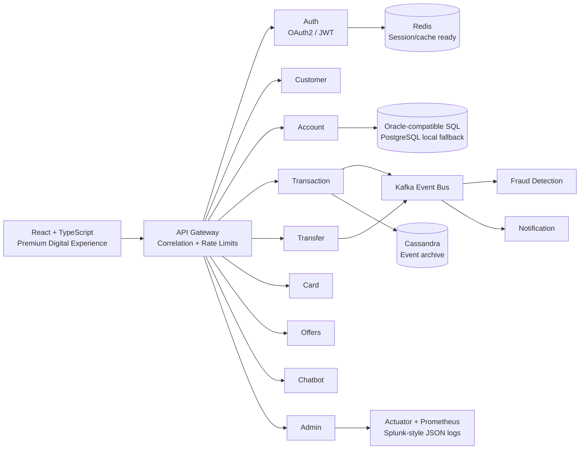
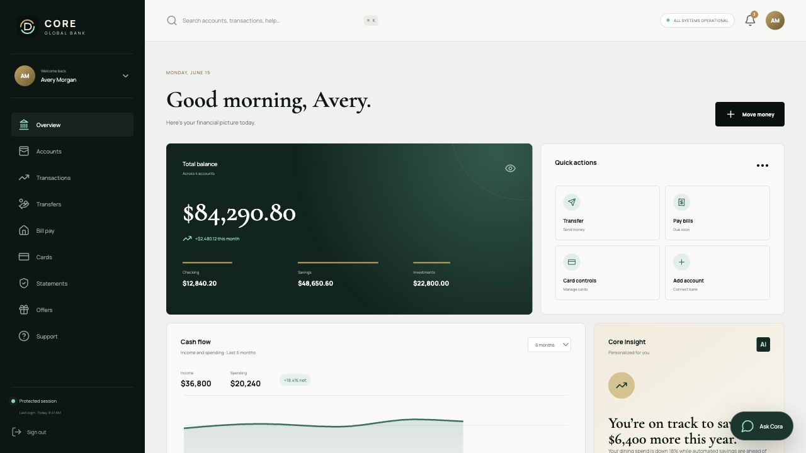
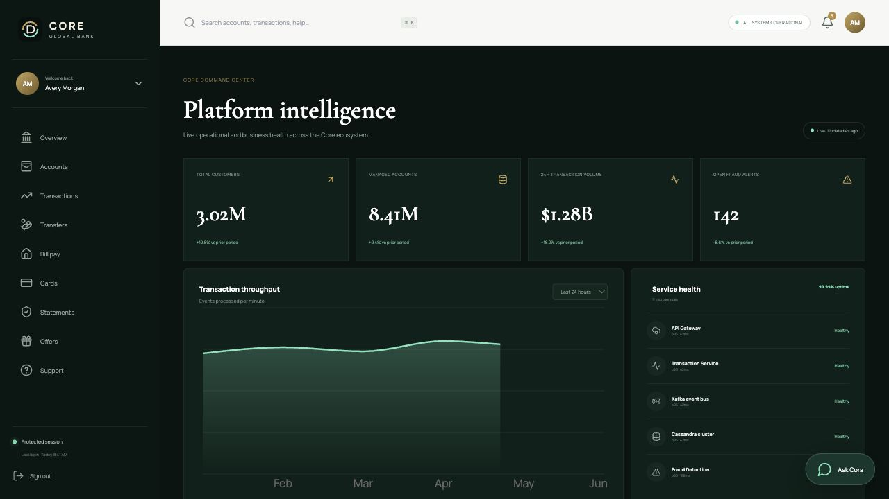

# Core Global Bank

**Core Global Bank** is a portfolio-grade digital banking platform that pairs an original luxury banking experience with an event-driven Java microservices backend. It is designed to demonstrate the architecture, delivery practices, and engineering judgment expected in large-scale financial services.

> Core Global Bank is an original fictional brand. The product, visuals, copy, cards, screens, and generated assets do not use or reproduce real-bank assets.

## Experience

- 25 responsive public, authentication, customer portal, support, and admin routes
- Code-generated black/gold and platinum cards, animated globe, app mockup, charts, and visual assets
- Realistic customer workflows for accounts, transfers, bill pay, card freeze, statements, offers, and support
- Interactive admin command center with service health, Kafka event activity, fraud alerts, and product analytics
- Accessible motion, responsive layouts, skeleton-ready panel structure, and focused micro-interactions

## Architecture



The services follow domain-driven boundaries:

```text
service/
├── domain/model
├── domain/repository
├── application
├── infrastructure
└── interfaces/rest
```

## Technology Map

| Layer | Technology |
|---|---|
| Web | React 18, TypeScript, Tailwind CSS, Framer Motion, React Three Fiber, Three.js, Recharts |
| API | Java 17+, Spring Boot, Spring MVC, REST, JSON/XML, OpenAPI |
| Security | Spring Security, OAuth2 resource server foundations, RS256 JWT, BCrypt, roles |
| Data | Spring Data JPA, Oracle-style schema conventions, PostgreSQL/H2 fallback, Cassandra CQL |
| Events | Apache Kafka, named domain topics, producers and notification consumer |
| Quality | JUnit 5, Mockito, Spring repository tests, Cucumber/Gherkin |
| Delivery | Docker, Docker Compose, Jenkins declarative pipeline |
| Operations | Actuator, Prometheus metrics, correlation IDs, structured searchable logs |

## Services

| Service | Port | Primary responsibility | Event topic |
|---|---:|---|---|
| API Gateway | 8080 | Route catalog, edge controls | `gateway-events` |
| Auth | 8081 | Register, login, JWT, roles | `notification-created` |
| Customer | 8082 | Customer profile lifecycle | `customer-updated` |
| Account | 8083 | Account products and balances | `account-updated` |
| Transaction | 8084 | Ledger and concurrent settlement | `transaction-created` |
| Transfer | 8085 | Internal/external movement | `transfer-requested` |
| Card | 8086 | Card controls and limits | `card-status-updated` |
| Offers | 8087 | Rewards and offers | `offer-activated` |
| Notification | 8088 | Event-driven client messaging | `notification-created` |
| Fraud Detection | 8089 | Concurrent fraud rule engine | `fraud-alert-created` |
| Chatbot | 8090 | Cora concierge simulation | `chatbot-message-created` |
| Admin | 8091 | Analytics, audit, seed jobs | `admin-audit-created` |

## Quick Start

### Local UI

```bash
cd frontend
npm install
npm run dev
```

Open `http://localhost:5173`. The demo sign-in is prefilled; any submit enters the simulated secure portal.

### Local Java services

Each service uses an embedded H2 database in Oracle compatibility mode by default, so no infrastructure is required for a first run.

```bash
cd backend
mvn clean package
mvn -pl account-service spring-boot:run
```

Open:

- API: `http://localhost:8083/api/v1/accounts/summary`
- Health: `http://localhost:8083/actuator/health`
- Swagger UI: `http://localhost:8083/swagger-ui.html`

### Full Docker platform

Build the JARs first, then start the platform:

```bash
cd backend && mvn clean package && cd ..
docker compose up --build
```

Web is available at `http://localhost:3000`. Copy `.env.example` when customizing local secrets or ports.

## API Examples

```bash
# RS256 JWT login
curl -X POST http://localhost:8081/api/v1/auth/login \
  -H 'Content-Type: application/json' \
  -d '{"email":"avery@coreglobal.demo","password":"CoreDemo2026!"}'

# Paginated and sorted accounts (JSON)
curl 'http://localhost:8083/api/v1/accounts?page=0&size=20&sort=createdAt,desc&owner=avery'

# Selected endpoint as XML
curl -H 'Accept: application/xml' 'http://localhost:8083/api/v1/accounts?page=0&size=5'

# Event-producing transfer command
curl -X POST http://localhost:8085/api/v1/transfers/actions \
  -H 'Content-Type: application/json' \
  -H 'X-Correlation-ID: portfolio-demo-42' \
  -d '{"action":"TRANSFER_REQUESTED","ownerId":"avery","amount":500,"attributes":{"rail":"INTERNAL"}}'
```

## Seed Data

The repository **does not** commit or auto-generate millions of rows. The Admin service provides an asynchronous, indexed, batch-insert seed system using DataFaker. It uses bounded workers, configurable batches, and structured progress logs.

Small demo seed:

```bash
curl -X POST http://localhost:8091/api/v1/admin/seed-jobs
```

Custom seed:

```bash
curl -X POST http://localhost:8091/api/v1/admin/seed-jobs \
  -H 'Content-Type: application/json' \
  -d '{"counts":{"customers":1000,"accounts":2400,"transactions":10000},"batchSize":1000}'
```

The opt-in `?portfolioScale=true` profile represents **3M customers, 8M accounts, 25M transactions, 1M cards, 500K loans, and 2M offers**. Run it only against properly sized infrastructure.

## Testing

```bash
cd frontend && npm run lint && npm run build
cd ../backend && mvn test
```

Coverage includes Mockito service behavior, Spring Data repository behavior, concurrent fraud rules, and Cucumber scenarios in `backend/transfer-service/src/test/resources/features`.

## Security And Reliability

- RS256 JWT issuance, BCrypt 12-round hashing, Spring Security, and role-ready claims
- `CUSTOMER`, `ADMIN`, and `SUPPORT` roles modeled in token claims and service contracts
- Correlation ID propagation via `X-Correlation-ID`
- In-memory edge rate-limit simulation and global exception envelopes
- Concurrent fraud assessment and settlement processing with bounded executors
- Audit fields, validation, paging, sorting, filtering, and searchable structured logs
- No real credentials, bank data, or production secrets in the repository

## Observability

Every service exposes `/actuator/health`, `/actuator/metrics`, and `/actuator/prometheus`. Console output is JSON-shaped for Splunk-style search and includes service, level, thread, and correlation ID. The admin UI provides a Dynatrace-style operational view for service health and event activity.

Useful searches:

```text
correlationId=CG-* level=ERROR
service=fraud-detection-service eventType=FRAUD_ALERT_CREATED
service=transfer-service message=event_published
```

## CI/CD

`Jenkinsfile` implements frontend quality gates, Maven verification, JUnit report publishing, container builds, and an Actuator smoke test. The architecture is AWS/Azure ready: stateless services can deploy to ECS/EKS or App Service/AKS, Kafka maps to MSK/Event Hubs, PostgreSQL to RDS/Azure Database, Cassandra to Keyspaces/Cosmos DB, and metrics to CloudWatch/Azure Monitor.

## Screenshots

The repository’s visuals are generated locally from React, CSS, SVG, canvas, and Three.js. No manual image downloads are required.

### Cinematic homepage


### Customer overview



### Platform intelligence



## Resume Bullets

- Architected an event-driven digital banking platform with 11 Spring Boot microservices, Kafka domain events, Oracle-compatible relational persistence, and Cassandra event storage.
- Built a premium TypeScript/React banking experience spanning 25 routes with Three.js visuals, Framer Motion storytelling, Recharts analytics, and responsive authenticated workflows.
- Implemented RS256 JWT authentication, BCrypt hashing, role-ready authorization, validation, rate limiting, correlation tracing, structured logging, and concurrent fraud/settlement processing.
- Delivered Dockerized local infrastructure and Jenkins CI/CD with JUnit, Mockito, Spring Data, Cucumber BDD, Actuator health gates, and scalable synthetic data generation.

## ATS Keywords

Java 17, Spring Boot, Spring MVC, Spring Data JPA, Spring Security, OAuth2, JWT, REST API, JSON, XML, Apache Kafka, event-driven architecture, domain-driven design, Oracle SQL, PostgreSQL, Cassandra, Redis, Apache Tomcat, J2EE, multithreading, concurrency, microservices, Docker, Jenkins, CI/CD, JUnit, Mockito, Cucumber, Gherkin, Splunk, Dynatrace, AWS, Azure, React, TypeScript, Tailwind CSS.

## Troubleshooting

- **Port conflict:** override `SERVER_PORT` for a Java service or change the Compose mapping.
- **Kafka unavailable:** local Java services default to `KAFKA_ENABLED=false`; enable it only with a broker running.
- **Docker build cannot find JAR:** run `cd backend && mvn clean package` before `docker compose build`.
- **Cassandra adapter:** activate the `cassandra` Spring profile after applying `platform/cassandra/schema.cql`.
- **Oracle deployment:** replace the PostgreSQL driver, set the Oracle JDBC URL, and apply the mappings documented in `platform/postgres/init.sql`.

## Repository Map

```text
├── frontend/              # Premium React digital experience
├── backend/               # Maven multi-module Spring platform
├── platform/              # SQL and Cassandra schemas
├── docs/                  # Architecture and API notes
├── docker-compose.yml     # Local service discovery and infrastructure
├── Jenkinsfile            # Enterprise CI/CD pipeline
└── Makefile               # Common developer workflows
```
